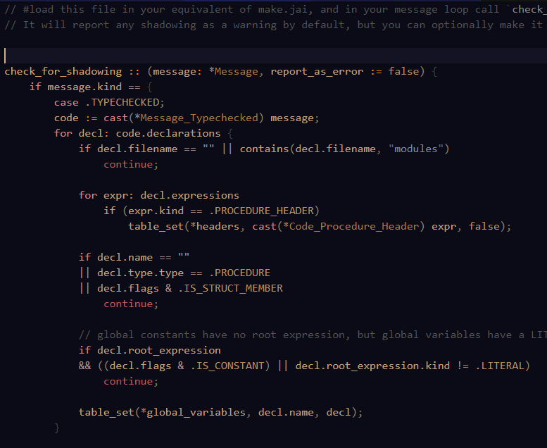
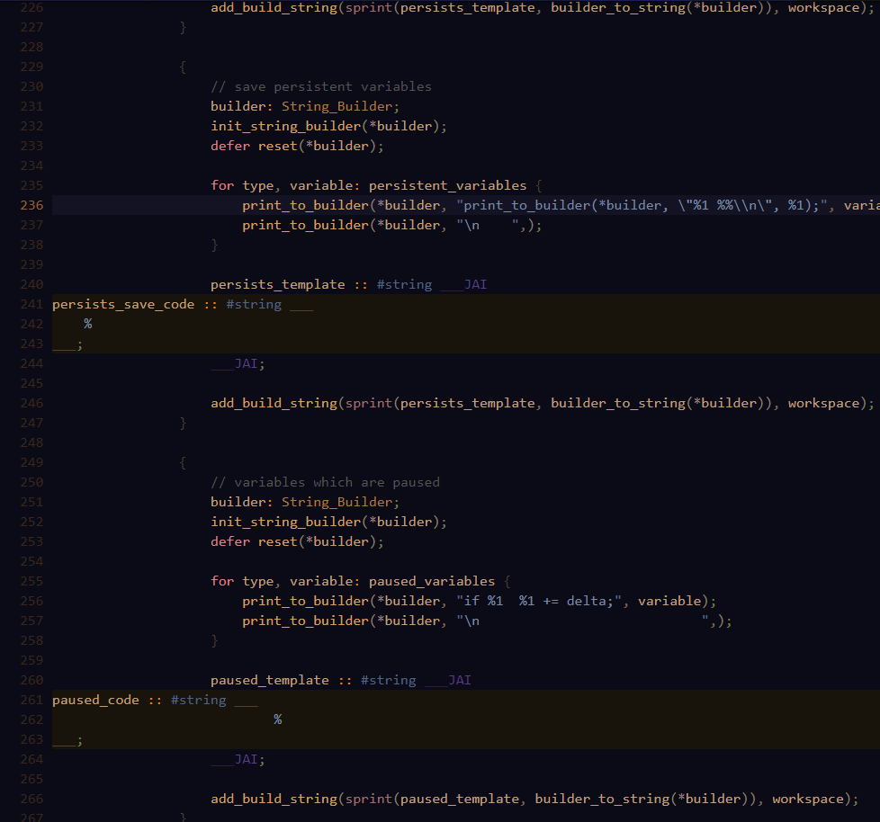
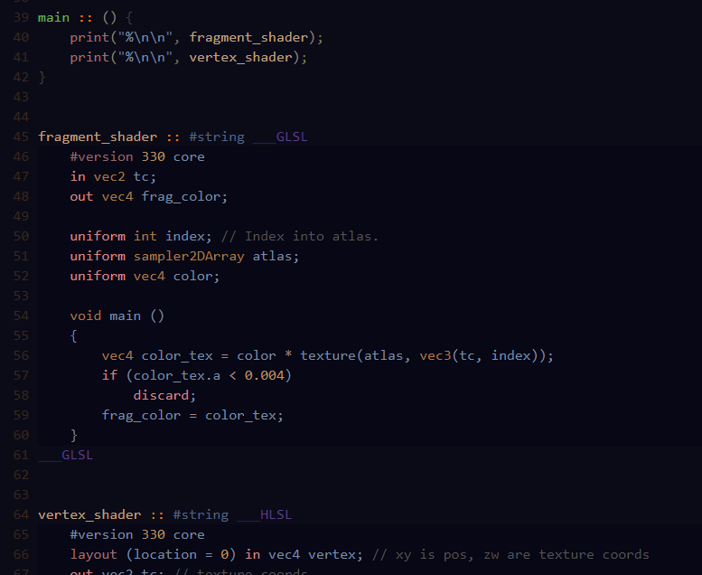
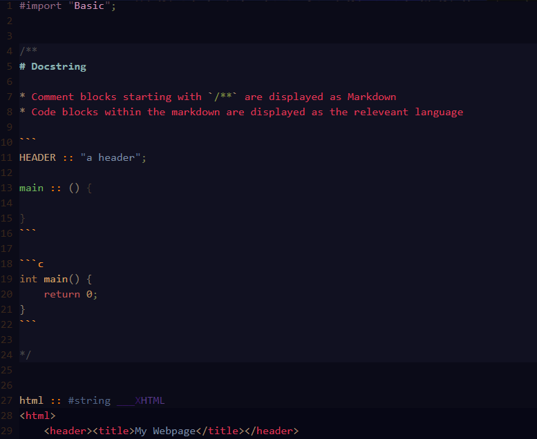
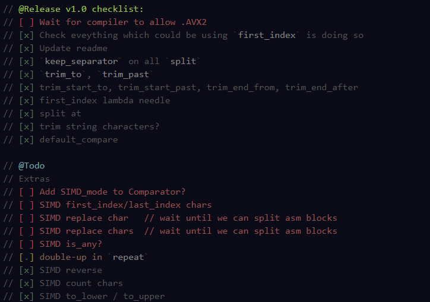
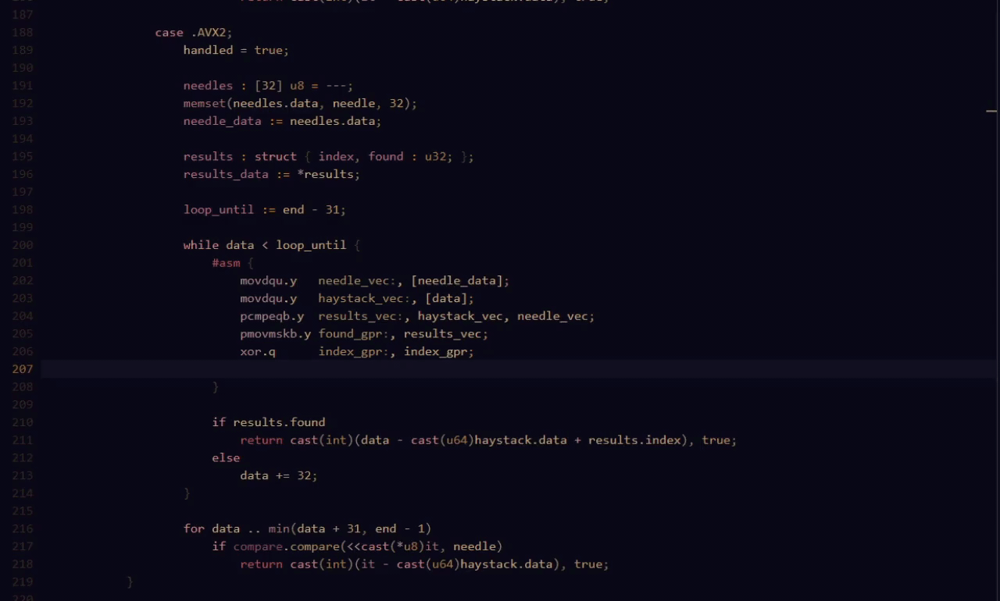

# The Language - Jai Language support

VSCode extension for Jai language support.

Syntax highlighting:


Highlight language inside herestring (postfix `HERE` with language ID)...


...which lets you nicely embed shaders


Uses Markdown for docstrings


Comment tags + checklists


Autocomplete x64 instructions



# IDE-like functionality

*Note: this feature is far from polished!*

The extension provides Rename, Definition and Reference Providers. These work using the compiler, using the now-standard metaprogram plugin interface, so you only have to specify the compiler's location (path to the executable) and which .jai file you use to build your project in the extension settings. To do so, in the project folder make a `.vscode/settings.json` file that looks like this:

```json
// Place your settings in this file to overwrite default and user settings.
{
    "the-language.pathToJaiExecutable": "c:\\path\\to\\jai.exe", // You might want to set a good default path for this in VS Code's graphical "Extension Settings" editor. 
    "the-language.projectFile": "c:\\path\\to\\build.jai"
}
```

This method works both for simple programs that use the Default_Metaprogram, and for projects that setup their own workspaces.
